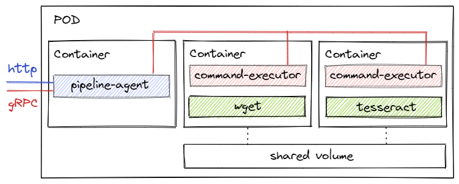
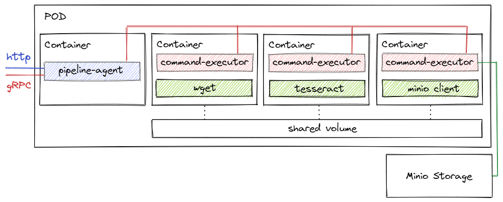

# Text recognising application

Demo with a text recognition application.

The app comes in two types of deployment:
1) With two containers: Wget (redundant, used for demo purposes only) and [Tesseract](https://github.com/tesseract-ocr/tesseract). In this scenario, an image is loaded with subsequent text recognition.



```yaml
{
  "commands": [
    {
      "executorName": "wget",
      "commandLines": [
        "wget -O /mnt/pipe/image.png https://i.stack.imgur.com/2rb88.png"
      ]
    },
    {
      "executorName": "tesseract",
      "commandLines": [
        "tesseract /mnt/pipe/image.png /mnt/pipe/result",
        "cat /mnt/pipe/result.txt"
      ]
    }
  ]
}
```

2) With three containers: Wget, Tesseract, [Minio](https://min.io/) client. This scenario complements the previous one - in the container with the Minio client, the recognized text is stored in the Minio storage.



```yaml
{
  "commands": [
    {
      "executorName": "wget",
      "commandLines": [
        "wget -O /mnt/pipe/TMP_RichTextLineIndent.png https://docs.unity3d.com/Packages/com.unity.textmeshpro@3.2/manual/images/TMP_RichTextLineIndent.png",
        "wget -O /mnt/pipe/35SY5.png https://i.stack.imgur.com/35SY5.png",
        "wget -O /mnt/pipe/717a5af4bda85e300676c3e8ac369ed4.jpg https://i.pinimg.com/originals/71/7a/5a/717a5af4bda85e300676c3e8ac369ed4.jpg"
      ]
    },
    {
      "executorName": "tesseract",
      "commandLines": [
        "for file in $(ls -v /mnt/pipe); do tesseract /mnt/pipe/$file /mnt/pipe/${file%.*}; rm /mnt/pipe/$file; done"
      ]
    },
    {
      "executorName": "mc",
      "commandLines": [
        "mc alias set k8s http://ocr-minio:9000 accessKeyOCR secretKeyOCR",
        "mc mb k8s/5840e11b-2117-4036-a6e6-bcff03fbd3c9",
        "mc cp --recursive /mnt/pipe/ k8s/5840e11b-2117-4036-a6e6-bcff03fbd3c9",
        "rm -r /mnt/pipe/*"
      ]
    }
  ]
}
```