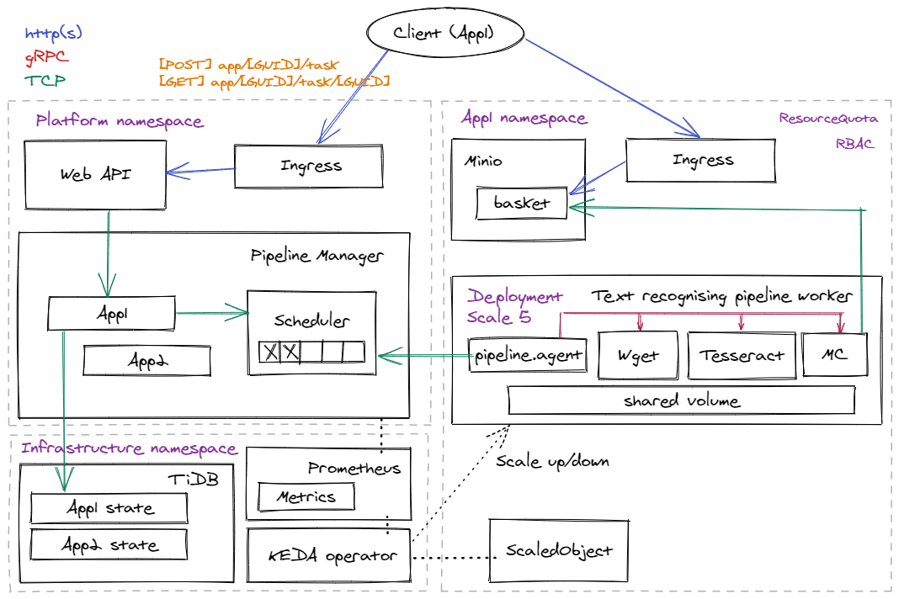

# Text recognising application

Demo with a text recognition application.

As part of this application, the following resources are deployed on the Kubernetes cluster:
1) MinIO storage with Ingress.
2) Pipeline worker, consisting of 3 steps: **Wget** *(redundant step, for demonstration purposes)*, **Tesseract**, **MinIO** client with a shared volume.
3) ScaledObject for scaling pipeline workers.
4) ResourceQuota and RBAC for Application namespace.

## Sample request with a task
```yaml
{
  "pipeline": [
    {
      "executorName": "wget",
      "commands": [
        "wget -O /mnt/pipe/2rb88.png https://i.stack.imgur.com/2rb88.png",
        "wget -O /mnt/pipe/text-photographed-eng.jpg https://www.imgonline.com.ua/examples/text-photographed-eng.jpg",
        "wget -O /mnt/pipe/Cleartype-vs-Standard-Antialiasing.gif https://upload.wikimedia.org/wikipedia/commons/b/b8/Cleartype-vs-Standard-Antialiasing.gif"
      ]
    },
    {
      "executorName": "tesseract",
      "commands": [
        "for file in $(ls -v *.*) ; do tesseract $file {file%.*}.txt; done"
      ]
    },
    {
      "executorName": "mc",
      "commands": [
        "mc mb buckets/5840e11b-2117-4036-a6e6-bcff03fbd3c9",
        "mc cp --recursive /mnt/pipe/ buckets/5840e11b-2117-4036-a6e6-bcff03fbd3c9",
        "rm -r /mnt/pipe/*"
      ]
    }
  ]
}
```

## Scenario
1) The client creates pipeline tasks through API Gateway. Each task contains a list of URLs for images with text.
2) Pipeline workers intercept tasks from a task scheduler. The number of pipeline workers is adjusted based on the number of tasks for a given type of application in the task scheduler queue.
3) For each URL, the pipeline sequentially performs the following steps: uploading an image via Wget, OCR using Tesseract and saving the result to MinIO using its client. All intermediate data is stored on a shared volume and deleted after the task is completed.
4) The client performs GET requests to the API Gateway until it receives the 'Completed' status for the task. The body of the response message contains a GUID with a basket in MinIO with a recognized text for each image.

## Workflow diagram

